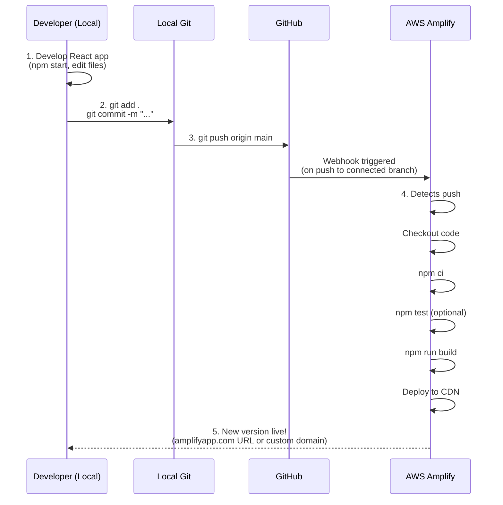

# React Deploy to AWS Amplify

## Summary

> <mark>Amplify</mark> turns any React repo into a production-grade, auto-deploying frontend in minutes — no servers to manage.

## Amplify

**AWS Amplify** is a full-stack development platform from AWS designed to help developers quickly build, deploy, and scale modern web and mobile applications — especially **React** apps (including Create React App, Vite, Next.js).

For **React** deployment, Amplify Hosting provides a **Git-based continuous deployment** workflow:

- Connect your GitHub, GitLab, Bitbucket, or AWS CodeCommit repository.
- Amplify automatically detects every `git push` to a branch (usually `main`).
- It runs a fully managed **CI/CD pipeline**: installs dependencies (`npm ci`), executes tests (if configured), builds the app (`npm run build`), and deploys the static assets to a global **CDN** powered by CloudFront.
- Your app becomes instantly live at a generated `*.amplifyapp.com` URL or your custom domain.
- Features include: preview environments for pull requests, instant cache invalidation, atomic deploys, custom build settings (e.g., environment variables), and built-in support for server-side rendering (SSR) frameworks.

## Set up Amplify

> AWS Amplify Hosting supports deploying **React** apps (e.g., Create React App, Vite + React, or similar) from a **monorepo** (single Git repository containing multiple apps/packages, like Yarn workspaces, Nx, Turborepo, or plain subfolders) with automatic detection for many setups. 

Here are the **4 main steps** in the Amplify console UI for connecting and deploying a React app from a monorepo:

1. **Create new app & connect repository**  
   Sign in to the AWS Amplify console → Choose **Host web app** (or **Create new app** > **Host web app**).  
   Authorize and select your Git provider (GitHub, GitLab, Bitbucket, etc.).  
   Pick your monorepo repository from the list and select the branch (e.g., main).

2. **Specify monorepo & app location**  
   On the **Add repository branch** / **Configure build settings** screen, check the box **My app is a monorepo** (this is the critical toggle).  
   In the **App root** (or **Application root**) field, enter the relative path to your React app inside the repo (e.g., `apps/my-react-app`, `frontend`, `packages/web`, or `client`).  
   Amplify auto-detects common monorepo tools (Yarn workspaces, Nx, Turborepo, etc.) and suggests build settings.

3. **Review/edit build settings**  
   Amplify pre-fills a build spec (amplify.yml) based on detection:  
   
   - PreBuild: usually `npm ci` or `yarn install`  
   - Build: `npm run build` or equivalent  
   - Artifacts: `baseDirectory` points to your build output (e.g., `build`, `dist`, `.next` for Next.js hybrids)  
     Confirm/edit if needed (especially `baseDirectory`). For multiple apps in the same repo, you can later add more Amplify apps with different **appRoot** values.

4. **Save & deploy**  
   Click **Save and deploy**.  
   Amplify runs the first build → installs deps, builds your React app from the specified root, deploys static files to CloudFront CDN.  
   Once complete, get the live URL (e.g., `https://main.dxxxx.amplifyapp.com`). Future `git push` triggers automatic CI/CD builds/deployments.

This setup uses the `AMPLIFY_MONOREPO_APP_ROOT` environment variable internally (auto-set from your UI input) to scope builds correctly. 

## Deploy Flow

1. **Local dev (React)** `npm start` → develop your app locally
2. **Local commit**: `git add .git commit -m "feat: add dark mode toggle"`
3. **Push to GitHub**: `git push origin main`
4. **GitHub ↔ AWS Amplify connection** (set up once)
   Amplify is connected to your repo + branch (usually main)
5. **Every push → CI/CD → deploy & publish** Amplify automatically:
   - pulls code
   - runs build (npm run build)
   - deploys static files to global CDN
   - new version is live in ~1–3 minutes

